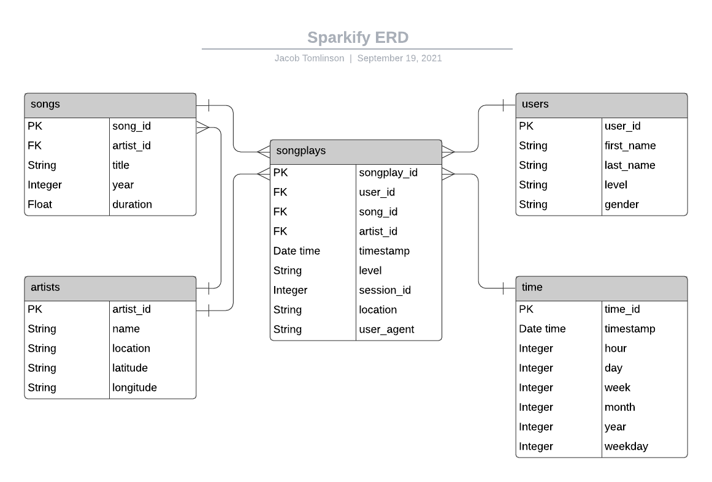

# Sparkify

Sparkify, a pretend startup, wants to analyze data on their music streaming app. What songs are people listening to? What artists get the most play time? What type of users are listening to the most music? In order to answer those questions, this project takes JSON files full of data and transforms it into a Postgres database full of tables worth querying. 

## How to use these files locally
1. Download/Fork the repository.
2. Create a credentials.json file where the keys username and password are present. These should be equal to the values that will log you in to your local Postgres database.
3. Run create_tables.py. This will create a fresh sparkdb Postgres database, and create the tables for that database.
4. Run etl.py. This will process that data listed below and add that data to the tables just created.
5. Have fun querying the database :)

## Data in this project:
- **song_data** -- A subset of the [Million Song Dataset](http://millionsongdataset.com), nested in JSON files. Each file contains metadata about a song and the artist of that song.
- **log_data** -- JSON files generated by [eventsim](https://github.com/Interana/eventsim), which simulate activity logs from a music streaming app based on specified configurations.

## Files in this project:
- **sparkify_app.py** -- This is a [streamlit](https://streamlit.io) app which displays the different tables created in this project, as well as some simple bar charts of the grouped data. Will be hosted in the future.
- **create_tables.py** -- This file drops and creates the database tables. This file is run to reset the tables before each ETL script run.
- **etl.ipynb** -- Reads and processes the first file from the song_data and log_data folders and loads them into the tables and contains detailed instructions on the process. This is the building block used to create etl.py.
- **etl.py** -- Reads and processes files from the song_data and log_data folders and loads them into the database tables.
- **sql_queries.py** -- Contains all SQL queries for the project.
- **test.ipynb** -- Helper file to query the database after the tables are created and data is inserted.

## ERD of the database created in this project

